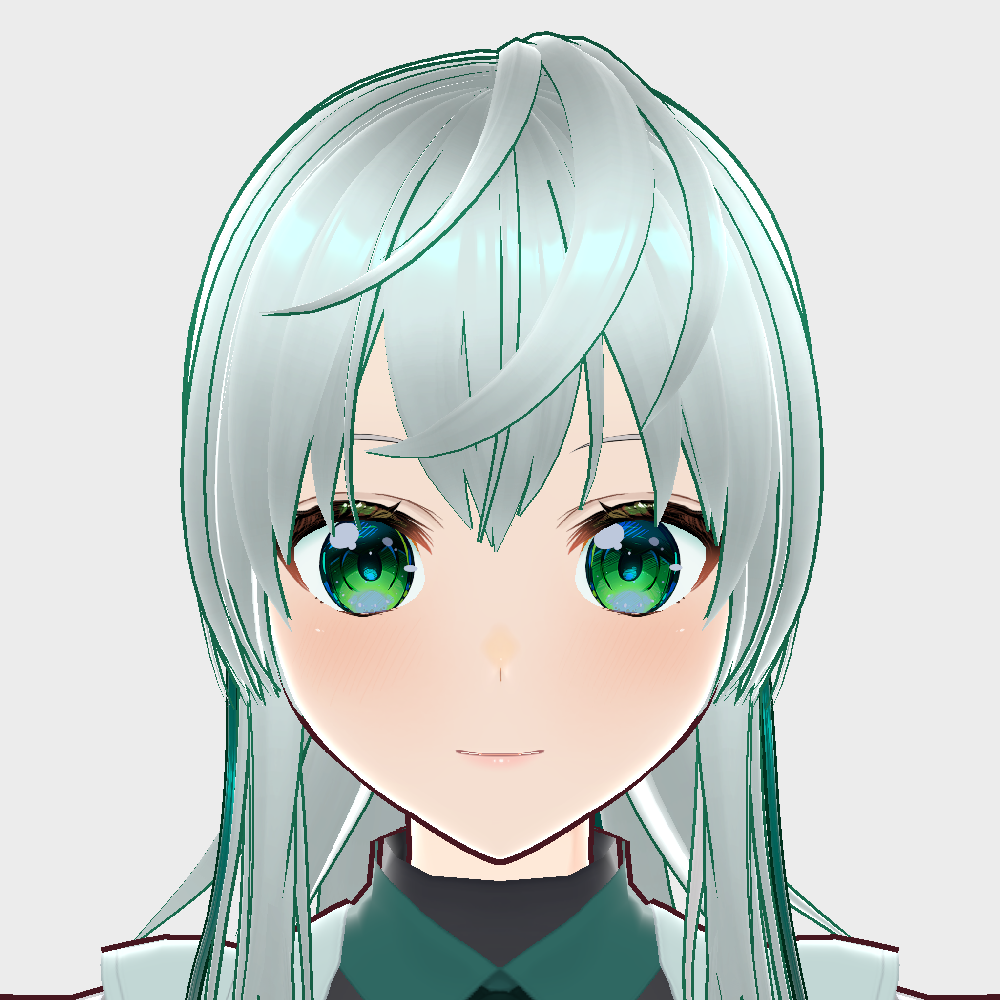

# VRAIM ~ VR AI Multimodal Dialogue System ~
***

## 概要
RemdisのシステムとUnityのシステムを連携して、マルチモーダル対話をVR空間で実現するプロジェクト。

## 注意事項
本システムは開発者の環境では動作しますが、利用者の環境での動作を保証するものではありません。

## ドキュメントリンク

- [環境構築](doc/Readme/0_enviroment_building_ja.md)
  - [アニメーションの初期設定](doc/Readme/4_MetaQuest_Execute_Guide_ja.md)
  - [ジェスチャー認識の有効化](doc/Readme/3_Active_Gesture_Recognition_ja.md)
- [実行方法](doc/Readme/1_execute-guide_ja.md)
  - [MetaQuestでの実行方法](doc/Readme/4_MetaQuest_Execute_Guide_ja.md)
- 開発
  - [環境概要](doc/Readme/Environmental_OverView.md)
  - [システムの全体図](doc/Readme/SystemOverView.md)
  - [RabbitMQとの連携](doc/Readme/RabbitMqClient.md)

## Remdisへの変更点

### プロンプト

Remdis/modules/prompt/response.txt  
複数の質問を重ねるようにエージェントが応答してしまうため、応答内容に含める質問は一つに絞るようにプロンプトを変更しています。  

``` diff
==
あなたはユーザと雑談するアシスタントです． 
-次のユーザ発話に対する気の効いたリアクションや質問を作成し，句読点（、,。,！,？）で分割して出力してください．
+次のユーザ発話に対する気の効いたリアクションや一つの質問を作成し，句読点（、,。,！,？）で分割して出力してください．
文章の区切りには空白を入れてください．最後にアシスタントの感情（0_平静,1_喜び,2_感動,3_納得,4_考え中,5_眠い,6_ジト目,7_同情,8_恥ずかしい,9_怒り）と動き（0_待機,1_ユーザの声に気づく,2_うなずく,3_首をかしげる,4_考え中,5_会釈,6_お辞儀,7_片手を振る,8_両手を振る,9_見渡す）を出力してください．出力は以下のフォーマットに従ってください
==
こんにちは。よろしくお願いします。/0_平静,2_うなずく
==
```

### コード

Remdis/modules/dialogue.py  
本研究室の環境では一つ前の発話に対して応答してしまったため、遅延を設けています。  

``` diff
# 随時受信される音声認識結果に対して並列に応答を生成
def parallel_response_generation(self):
  # 受信したIUを保持しておく変数
  iu_memory = []
  new_iu_count = 0

  while True:
    ~~~~
    省略
    ~~~~
      # ユーザ発話終端の処理
      if input_iu['update_type'] == RemdisUpdateType.COMMIT:
        # ASR_COMMITはユーザ発話が前のシステム発話より時間的に後になる場合だけ発出
        if self.system_utterance_end_time < input_iu['timestamp']:
+            time.sleep(0.75)
            self.event_queue.put('ASR_COMMIT')
        iu_memory = []
```

## オリジナル3Dキャラクター「米山アイ」
本プロジェクトではオリジナル3Dキャラクター「米山 アイ（よねやま あい）」を使用しています。
名前は米沢の米と山形の山、直江兼続の兜とAIをかけて米山アイとしました。

のぎねん による この作品はCC BY 4.0ライセンスで提供されています。
このライセンスのコピーを見るには、[https://creativecommons.org/licenses/by/4.0/](https://creativecommons.org/licenses/by/4.0/)にアクセスしてください。



モデル製作者：のぎねん

## 参考文献

- 細谷謙多・関戸陽士・小坂哲夫,”生成AIを用いたVR空間内3Dエージェントとの音声対話システムの開発”, HCS, HCS2024-40
pp.35-40, 2024
- 細谷謙多・関戸陽士・小坂哲夫,”生成AIを用いたVR空間内3Dエージェントとのマルチモーダル対話システムの開発”, 日本音響学会春季講演論文集, 2025
