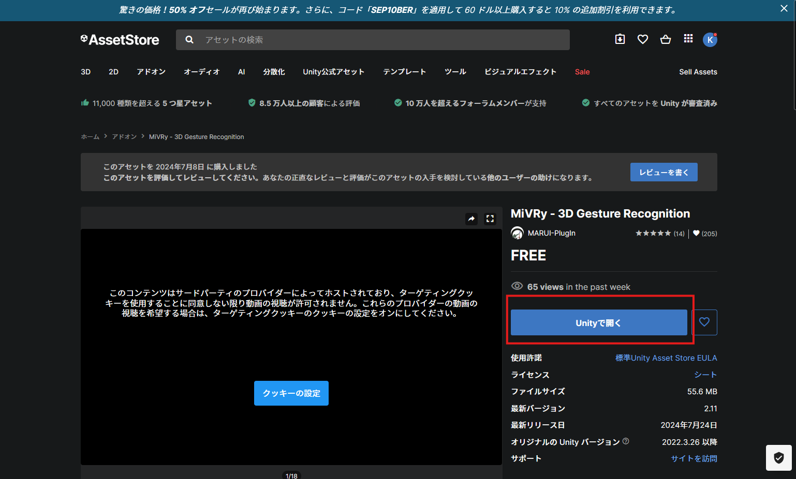
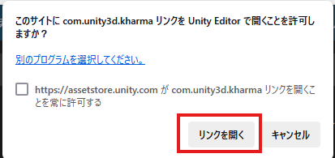
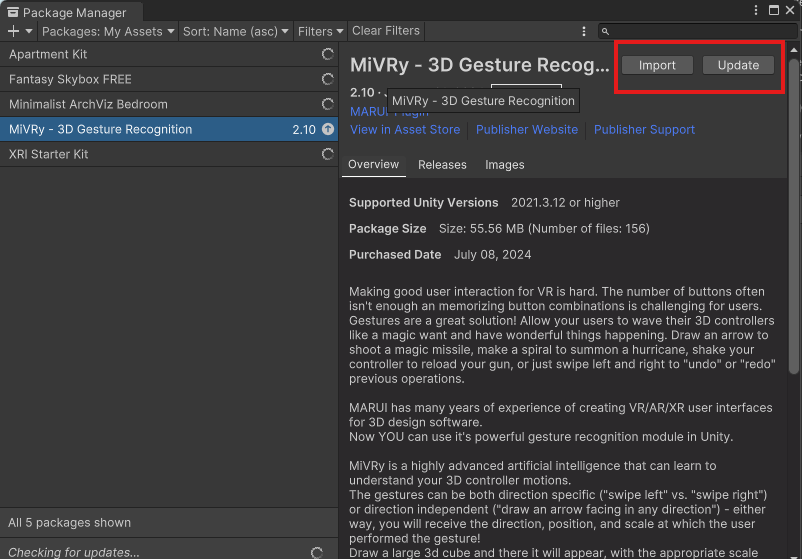
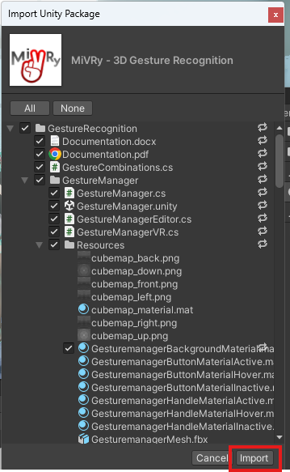
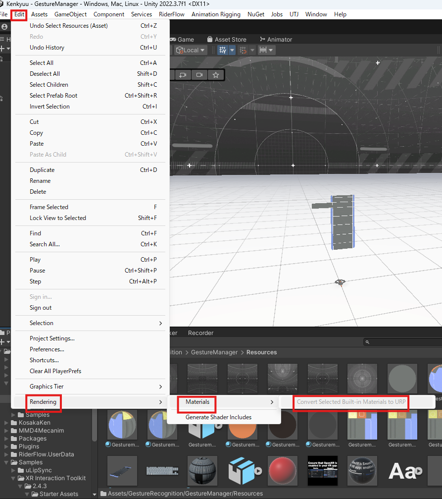
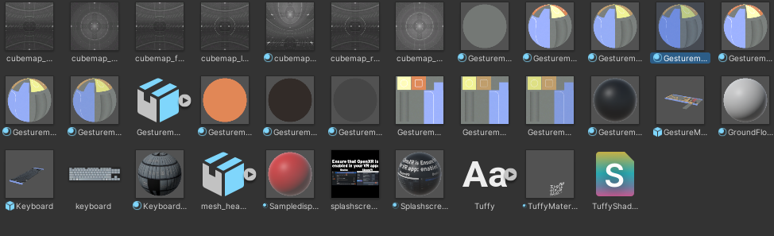
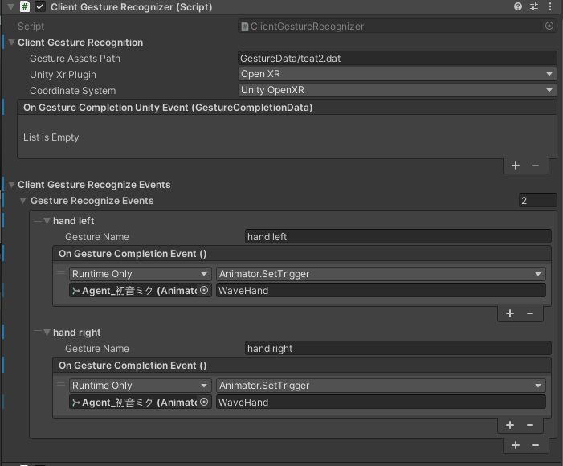

# ジェスチャー認識のセットアップ

## セットアップ

### 必要なパッケージの追加

以下のリンクにあるアセット(MiVRy)をインポートする。  
[MiVRy - 3D Gesture Recognition | Unity Assets Store](https://assetstore.unity.com/packages/add-ons/mivry-3d-gesture-recognition-143176?locale=ja-JP&srsltid=AfmBOop8qW-DW5R1TFjBC5vBOpcWDbfO_yJSIHxijNZTGShOkk-2JUD5)  

マイアセットに追加するというボタンを押すと、Unityで開くに変わるので同じようにボタンを押します。  

押すとポップアップが出てくるのでUnityで開くを押します。  
  

押すとUnity側でPackage Managerが開くので、右上から`download`→`import`を押す。  
 `download`を押してダウンロードが完了すると`import`に表示が変わります。

`import`を押すと`import Unity Package`ウィンドウが開くので、そのまま`import`ボタンを押します。  

インポート後、何もエラーが出なければ完了です。

### MiVRy対応の拡張パッケージをインポート

`Assets/KosakaKen`にある追加パッケージから`GestureRecognition`をインポートします。

## ジェスチャーの学習

ジェスチャーを認識させるには、まず認識させたいジェスチャーの動きを学習させる必要があります。  

### シーンを開く

ジェスチャーの学習をするためのシーンがMiVRyから提供されているので開きます。  
開くシーンは`Assets/GestureRecognition/GestureManager/GestureManager.unity`です。  

### マテリアルの変換

おそらく、シーンを開くと全部ピンク色の状態になっていると思います。  
これはシーン内のマテリアルに設定されているレンダリング方法と、プロジェクトのレンダリング方法が一致していないことが問題です。マテリアルを変換しましょう。  
問題となっているマテリアルを探します。インポート時に特に変更を加えていなければ、シーンファイルと同じ場所に`Resouces`というフォルダがあるので、開くとピンク色になっているマテリアルがあるはずです。  
それらのマテリアルを全て選択した状態で、`Edit -> Rendering -> Materials -> Convert Selected Built-in Materials to URP`を選択してマテリアルを変換します。  
  

変換後はこのようになります。  

### シーンの実行

全部ピンク色になっているのが直ったら、HMDを接続して再生ボタンを押して実行します。  

### ジェスチャーの学習方法

ジェスチャーの学習方法については公式ドキュメントがあるので、詳しくはそちらを参照してください。  
[(ドキュメント) How to use the Gesture Manager | MiVRy Gesture Recognition Unity Plug-In Documentation](https://www.marui-plugin.com/documentation-mivry-unity/#gesturemanager)  
[(動画) MiVRy VR Gesture Manager (v2.4)](https://www.youtube.com/watch?v=xyqeacqpES8)

分かりにくかった部分だけ記載しておきます。

- 生成したログファイルはどこ？
  - `C:\Users\"ユーザー名"\AppData\LocalLow\"カンパニー名"\"プロジェクト名"`に保存されていました。
  - カンパニー名とプロジェクト名はUnityの`Project Setting -> Player Setting`から参照できます。
- シーン内のキーボードが真っ黒なんだけど
  - 入力は可能でした
  - QWERTY配列なのでキー配置の記憶を頼りに入力してください

## ジェスチャーの認識

ジェスチャー認識に役立つスクリプトを作成しています。  
Clientプレハブに`Client Gesture Recognizer`コンポーネントを追加してください。  
このスクリプトではMiVRyを使ったジェスチャー認識後の処理を簡単に追加できるようになっています。  

### 操作方法
ジェスチャーを認識させるには、コントローラーのトリガーボタンを押したままジェスチャーを行ってください。  
トリガーボタンを押している間の動作を記録して、学習したジェスチャーから一番近い動作を認識します。

### Client Gesture Recognition

- `Gesture Assets Path`
  - ジェスチャーを学習時に作成したファイルまでのパスを記述します。
  - ビルド後でも変わらないパスを記述したい場合はUnityのStreamingAssetsが使えます。
- `Unity Xr Plugin`
  - PCVRで使用する場合はOpenXR
  - クエスト単体で使いたい場合はOculusVR
- `Coordinate System`
  - 基本的にUnity OpenXR
  - Unreal系の選択肢はUnreal Engine関係です。
- `On Gesture Completion Unity Event(GestureCompletionData)`
  - 何かしらのジェスチャーを認識したときに呼び出されるイベントを登録できます。
  - 使い方はUnityEventと同じです。

### Client Gesture Recognize Events

特定のジェスチャーを認識したときだけ発火させるイベントを作成できます。

- Gesture Name
  - 認識させたいジェスチャー名を入力します。
  - 学習時のジェスチャー名と入力したジェスチャー名は一致している必要があります。
- OnGestureCompletionEvent()
  - 認識後に発火させたい処理を登録できます。