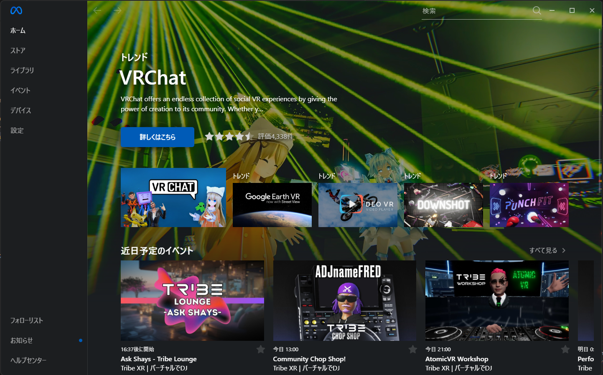
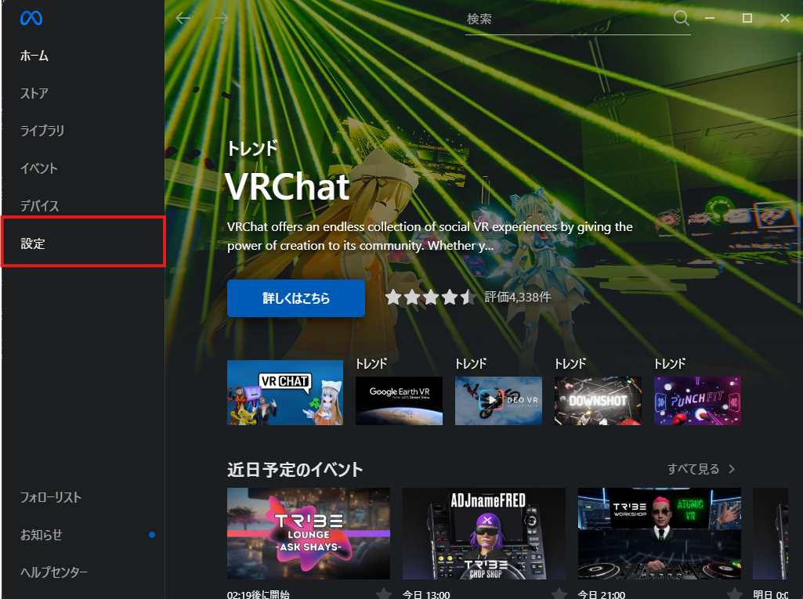
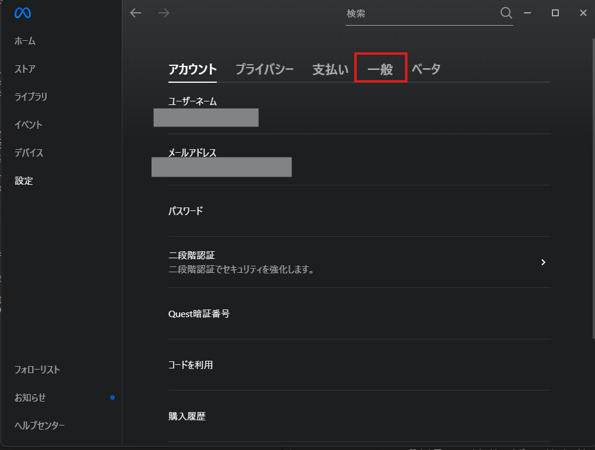
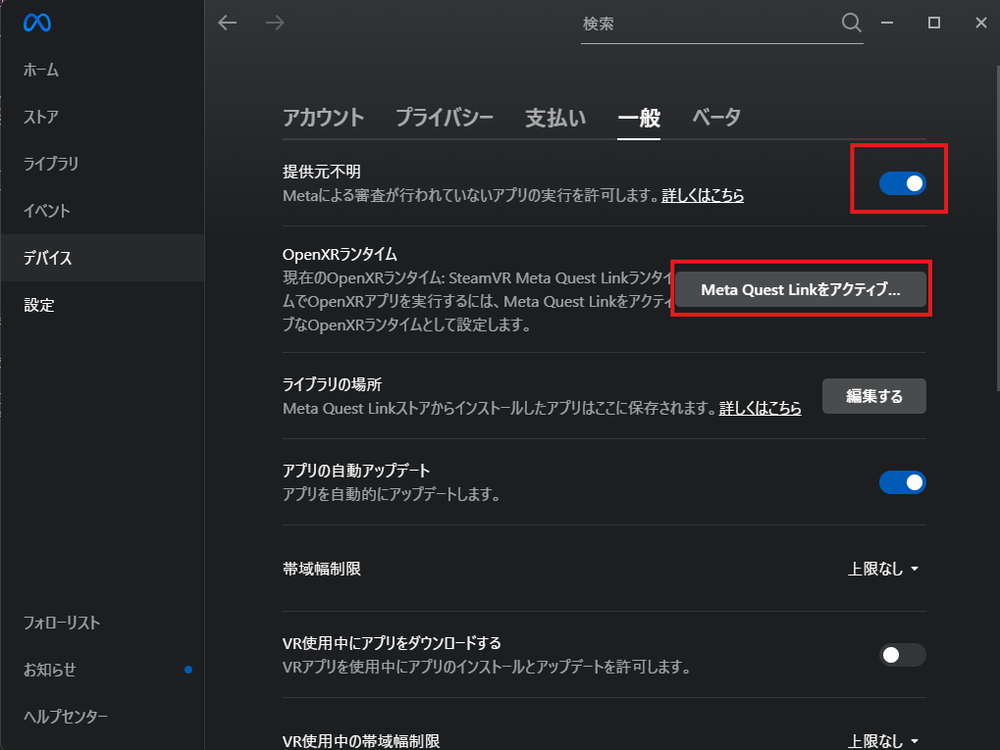
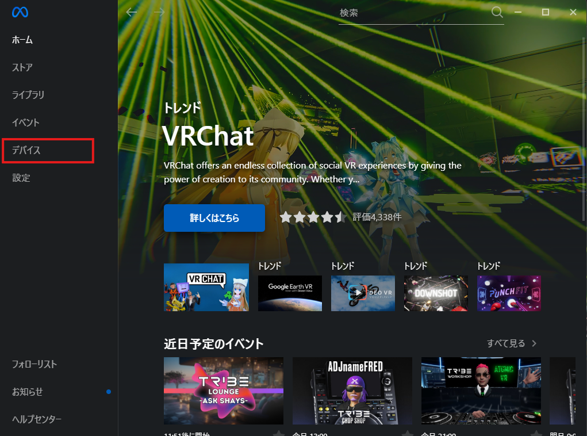
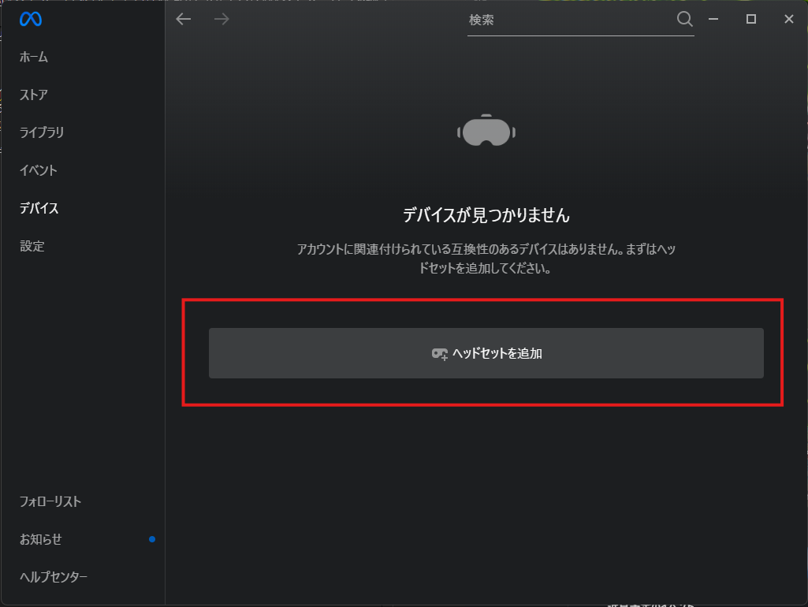
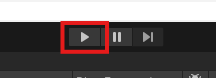

# Meta Questでの実行方法

作成(2024/9/5)

## 必要なソフトウェア

- Oculus(Meta) のデスクトップアプリをインストール
  - [ダウンロードリンク](https://www.meta.com/ja-jp/help/quest/articles/headsets-and-accessories/oculus-rift-s/install-app-for-link/)

## セットアップ

### Meta Quest Linkの設定

1. 初回起動時の案内に合わせてログインまで行う。
   起動出来たらこのような画面になる。
    

2. Meta Quest Linkの設定変更
   Unityの実行時にソフトがQuest側で表示されるように設定します。
   メニューから設定を押して開きます。
   

   設定を開いたら一般を押します。
   

   提供元不明の項目をON、Meta Quest Linkをアクティブのボタンを押します。  
   ボタンがグレーアウトしている場合は既にアクティブになっているので押さなくても大丈夫です。
   

3. デバイスの追加  
   メニューからデバイスを押して、デバイスタブを開く
   
   デバイスタブからデバイスを追加を押す
   
   画面の案内に従ってデバイスを追加してください。  
   接続方法はType-Cケーブルで繋ぐ方法と、ワイヤレス（AirLink）があるので接続したい方を選ぶ。  
   接続出来たら、Quest側では白い空間か部屋のような空間が表示されているはずです。

### 実行方法

Questで実行するには、Meta Quest Linkで接続した状態でUnityのPlayボタンを押して再生する。  

### 参考リンク

[Set up Link | Meta Store](https://www.meta.com/ja-jp/help/quest/articles/headsets-and-accessories/oculus-link/set-up-link/)  
[Unity + Meta Quest開発メモ - フレームシンセシス | Unityのエディタで再生するには](https://tech.framesynthesis.co.jp/unity/metaquest/#unity%E3%81%AE%E3%82%A8%E3%83%87%E3%82%A3%E3%82%BF%E3%81%A7%E5%86%8D%E7%94%9F%E3%81%99%E3%82%8B%E3%81%AB%E3%81%AF)