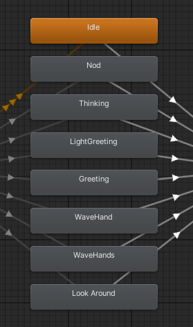
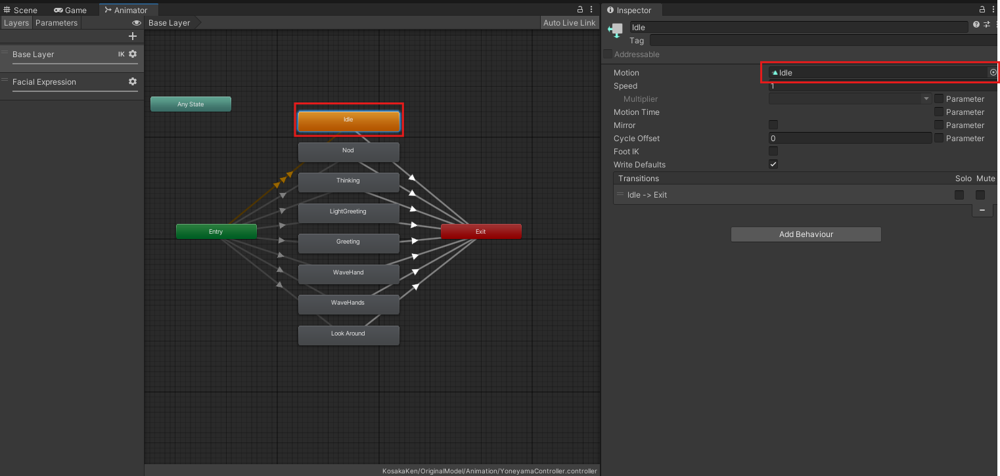

# アニメーションファイルの編集

エージェントの身体動作のため、いくつかのアニメーションファイルを使用していますが、
**権利上の問題からアニメーションファイルはプロジェクトデータには含めていません**。

## アニメーションの入手先

アニメーションファイルは[Mixamo](https://www.mixamo.com/#/)というサイトから入手できます。  
アニメーションをUnityにインポートする手順については[こちら](https://qiita.com/oeoepow/items/841e940c691bf4761b38)を参照してください。

### 入手するアニメーションの種類

入手するアニメーションの種類は以下の８種類です。
それっぽいアニメーションを探してインポートしてください。

- Idle (待機)
- Nod (頷き)
- Thinking (考える)
- LightGreeting (軽い挨拶)
- Greeting (挨拶)
- WaveHand (片手で手を振る)
- WaveHands (両手で手を振る)
- LookAround (辺りを見渡す)

### アニメーションの割り当て

それぞれのアニメーションをインポートできたらAnimation Controllerを開きます。  
開くAnimation Controllerの場所は`Assets/KosakaKen/OriginalModel/Animation/YoneyamaController.controller`です。  
割り当てたいアニメーションのブロックを選択して、インスペクターのMotionにアニメーションをドラッグアンドドロップで割り当てます。この操作を全てのアニメーションに対して行います。

