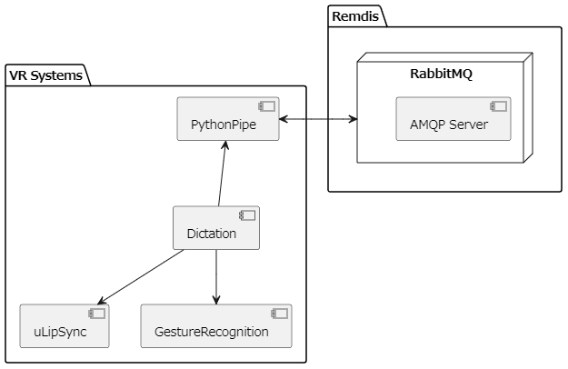

# システムの設計

## システムの全体図

## 各コンポーネントの役割

- PythonPipe  
  Remdisとの通信を制御するコンポーネント。  
  RabbitMQとの通信に関連するものはここに閉じ込めてある。

- DictationAI
  エージェントの動作を制御しているコンポーネント。  
  他にもRemdisから送られた音声データの再生など、PythonPipeで行っていないことを担当している。基本的にはここに新たなスクリプトなど様々な追加機能のファイルを作成していく。

- uLipSync  
  リップシンクをするためのコンポーネント。  
